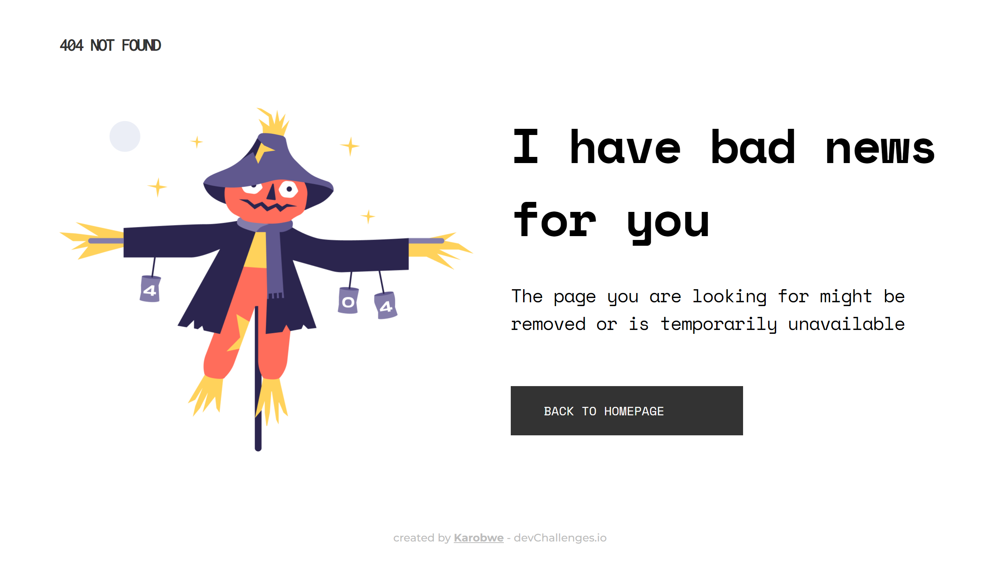

<!-- Please update value in the {}  -->

<h1 align="center">404 Not Found</h1>

   Solution for a challenge from  <a href="http://devchallenges.io" target="_blank">Devchallenges.io</a>.

  <h3>
    <a href="https://naughty-heyrovsky-392f47.netlify.app/">
      Demo
    </a>
     | 
    <a href="https://github.com/Karobwe/devchallenges-404-not-found">
      Solution
    </a>
     | 
    <a href="https://devchallenges.io/challenges/wBunSb7FPrIepJZAg0sY">
      Challenge
    </a>
  </h3>

<!-- TABLE OF CONTENTS -->

## Table of Contents

- [Overview](#overview)
  - [Built With](#built-with)
- [Features](#features)
- [Contact](#contact)
- [Acknowledgements](#acknowledgements)

<!-- OVERVIEW -->

## Overview

This project replicate the provided design by the challenge, using only HTML and CSS. Check the live demo stored on [Netlify](https://naughty-heyrovsky-392f47.netlify.app/).

This challenge was easy but took me 2 days to finish it because of decisions I had to make about how to organize my files and codes, and where to store the preview. I hope the time spent on this will help me on next challenges to gain time. I gave myself as imperatives to use Flexbox as much as possible. And this caused me some troubles when I had to position element to the nearest pixel as in the mock-up design.

### Built With

<!-- This section should list any major frameworks that you built your project using. Here are a few examples.-->

- HTML5
- CSS3

## Features

<!-- List the features of your application or follow the template. Don't share the figma file here :) -->

This application/site was created as a submission to a [DevChallenges](https://devchallenges.io/challenges) challenge. The [challenge](https://devchallenges.io/challenges/wBunSb7FPrIepJZAg0sY) was to build an application to complete the given user stories.

## Acknowledgements

<!-- This section should list any articles or add-ons/plugins that helps you to complete the project. This is optional but it will help you in the future. For exmpale -->

- [A Complete Guide to Flexbox](https://css-tricks.com/snippets/css/a-guide-to-flexbox/)
- [Tailwind's variables nomenclature](https://tailwindcss.com/docs/letter-spacing)

## Contact

- Website [karobwe.dev](https://karobwe.dev)
- GitHub [@Karobwe](https://github.com/Karobwe)
- Twitter [@Karobwe](https://twitter.com/Karobwe)
